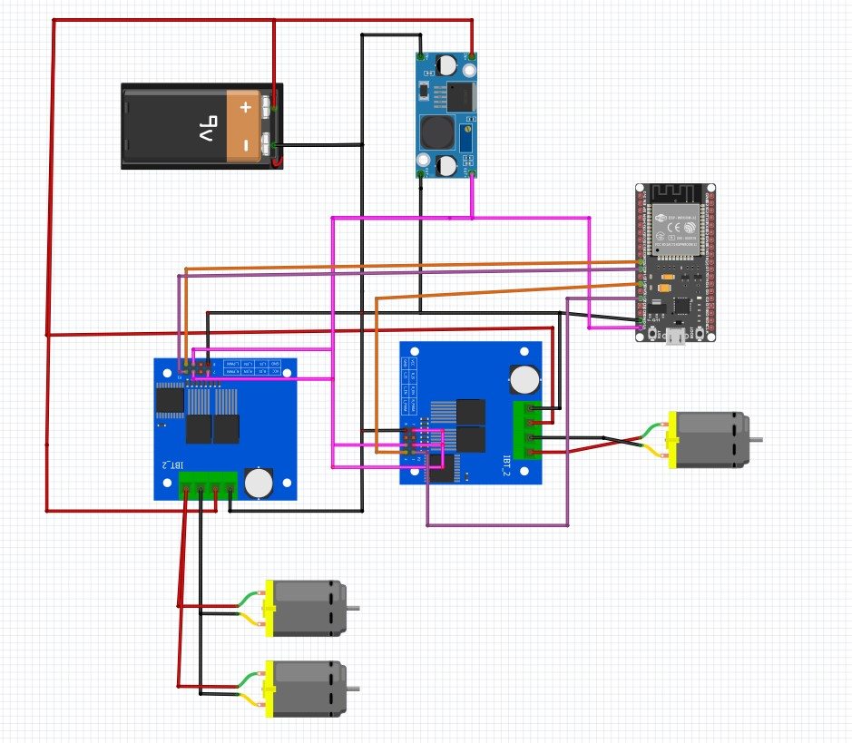

# 🏎️ ESP32 RC Car Upgrade (JR-RX Replacement)


> **From Web to Wheels:** A project converting a standard kid's ride-on car (previously using a broken JR-RX receiver) into a smart, Bluetooth-controlled vehicle using an ESP32 and high-power motor drivers.

---

## 📖 Table of Contents

- [Background](#-background)
- [Features](#-features)
- [Hardware Required](#-hardware-required)
- [Wiring Diagram & Pinout](#-wiring-diagram--pinout)
- [Software & Installation](#-software--installation)
- [Control & App](#-control--app)
- [Troubleshooting](#-troubleshooting)
- [Author](#-author)

---

## 🧐 Background

This project was born out of a need to repair a kid's ride-on car with a faulty stock receiver (JR-RX type). Instead of buying a proprietary replacement, I decided to upgrade the system entirely using an **ESP32**.

As a **Frontend Developer**, diving into hardware provided a unique perspective on how code interacts with the physical world. This project replaces the old system control of the original car with smooth **PWM-based acceleration (Soft Start)** and robust Bluetooth connectivity.

---

## ✨ Features

- **Bluetooth Classic Control:** Uses `BluetoothSerial` for reliable connection with Android phones.
- **High Power Driver:** Utilizes **BTS7960** (43A) drivers to handle heavy loads and steep inclines.
- **Soft Start Algorithm:** Prevents "whiplash" by gradually increasing PWM value, ensuring smooth acceleration for the child's safety.
- **Separate Steering Control:** Dedicated driver/channel for the steering motor.
- **Resource Optimized:** Hardwired "Enable" pins to 5V to save GPIO pins on the ESP32.

---

## 🛠 Hardware Required

| Component                | Quantity | Description                                           |
| ------------------------ | -------- | ----------------------------------------------------- |
| **ESP32 DevKit V1**      | 1        | The main microcontroller.                             |
| **BTS7960 Motor Driver** | 2        | High current H-Bridge (One for Drive, One for Steer). |
| **LM2596 Step Down**     | 1        | Buck converter (12V Battery -> 5V for ESP32).         |
| **Jumper Wires**         | -        | Female-to-Female & Male-to-Female.                    |
| **12V Battery**          | 1        | Existing car battery.                                 |
| **Android Phone**        | 1        | For the controller app.                               |

---

## 🔌 Wiring Diagram & Pinout



> _Figure: Complete wiring schematic connecting ESP32, BTS7960 Drivers, and Step Down Converter._

### 1. Main Power Circuit (12V Battery)

Connect the main power source from the Battery to the step-down converter and motor drivers.

- **Battery + (Positive)** connects to 3 points:
  - LM2596S pin `IN+`
  - BTS7960 #1 (Drive) pin `B+`
  - BTS7960 #2 (Steering) pin `B+`
- **Battery - (Negative/GND)** connects to 3 points:
  - LM2596S pin `IN-`
  - BTS7960 #1 (Drive) pin `B-`
  - BTS7960 #2 (Steering) pin `B-`

### 2. Logic Power Circuit (5V System)

This system uses 5V voltage provided by the LM2596S to power the ESP32 and logic pins.

> **⚠️ CRITICAL: Ensure the LM2596S output is adjusted to 5V using a multimeter BEFORE connecting to the ESP32!**

- **LM2596S pin OUT+ (5V)** connects to:
  - ESP32 pin `VIN`
  - BTS7960 #1 pin `VCC`
  - BTS7960 #1 pin `R_EN` & `L_EN` (To keep the driver always enabled)
  - BTS7960 #2 pin `VCC`
  - BTS7960 #2 pin `R_EN` & `L_EN` (To keep the driver always enabled)
- **LM2596S pin OUT- (GND)** connects to:
  - ESP32 pin `GND`

### 3. Output Circuit (To Motors)

Connecting the drivers to the physical DC motors.

- BTS7960 #1 pin `M+` & `M-` $\to$ Main Drive Motor (Type 380/390/550)
- BTS7960 #2 pin `M+` & `M-` $\to$ Front Steering Motor

### ⚠️ Important Notes

1. **Common Ground:** Ensure the Battery GND, ESP32 GND, and Driver GND are all connected together.
2. **Enable Pins:** `R_EN` and `L_EN` on the BTS7960 are connected directly to **5V** (VCC) to save ESP32 pins.

### 4. Pin Configuration Table

| ESP32 Pin   | Component Pin      | Function          |
| ----------- | ------------------ | ----------------- |
| **VIN**     | LM2596 OUT+        | 5V Power Input    |
| **GND**     | LM2596 OUT-        | Ground            |
| **GPIO 26** | Rear Driver RPWM   | Drive Forward     |
| **GPIO 27** | Rear Driver LPWM   | Drive Reverse     |
| **GPIO 12** | Steer Driver RPWM  | Turn Right        |
| **GPIO 13** | Steer Driver LPWM  | Turn Left         |
| **-**       | Driver R_EN / L_EN | **Connect to 5V** |

---

## 💻 Software & Installation

### Prerequisites

1. **Arduino IDE** installed.

### Installation Steps

1. Clone this repository:

```bash
git clone https://github.com/radanstromer-lgtm/Car-Toys-ESP32

```

2. Open the `.ino` file in Arduino IDE.
3. Select Board: **DOIT ESP32 DEVKIT V1**.
4. **Crucial Setting:** Go to `Tools` > `Partition Scheme` and select **"Huge APP (3MB No OTA/1MB SPIFFS)"**.

- _Note: This is required because the `BluetoothSerial.h` library is large._

5. Connect ESP32 via USB.
6. Click **Upload**.

- _Tip: If it gets stuck at `Connecting...`, hold the **BOOT** button on the ESP32 until writing begins._

---

## 📱 Control & App

You can use any "Bluetooth Serial Terminal" app from the Play Store.

- **Device Name:** `Mobil_ESP32_Final`
- **Baud Rate:** 9600 (Standard Bluetooth)

### Control Mapping (Characters)

| Character | Action                |
| --------- | --------------------- |
| **W**     | Move Forward (Press)  |
| **w**     | Stop Moving (Release) |
| **S**     | Move Backward (Press) |
| **s**     | Stop Moving (Release) |
| **A**     | Turn Left (Press)     |
| **D**     | Turn Right (Press)    |

---

## ⌨️ Bonus: Control via PC Keyboard (Python)

I have included a Python script (`remote.py`) that allows you to drive the car using your laptop's keyboard (WASD keys). This is perfect for testing or if you prefer physical keys over a touchscreen.

### Prerequisites

- **Python 3.x** installed on your computer.
- **Bluetooth** capability on your PC/Laptop.

### Setup Instructions

1.  **Pair the Device:**

    - Go to your PC's Bluetooth settings.
    - Pair with **`Mobil_ESP32_Final`**.
    - _Note: If asked for a PIN, try `0000` or `1234`._

2.  **Find the COM Port:**

    - Once paired, Windows will assign COM ports to the device.
    - Open **Device Manager** > **Ports (COM & LPT)**.
    - Look for "Standard Serial over Bluetooth link". You might see two ports; usually, you need the **Outgoing** port (or try both if unsure).

3.  **Install Dependencies:**
    Open your terminal/command prompt and install the required libraries:

    ```bash
    pip install pyserial keyboard
    ```

4.  **Configure the Script:**
    - Open `remote.py` in your code editor.
    - Update the `bluetooth_port` variable with your specific COM port (e.g., `'COM5'`).
    - Save the file.

### How to Run

Run the script as Administrator (required for the `keyboard` library to intercept key presses globally):

```bash
python remote.py
```

## 🔧 Troubleshooting

**Issue: "Guru Meditation Error" or Boot Loop**

- **Fix:** Ensure you are using a stable power supply (LM2596). If using Arduino IDE 2.0+, try downgrading the ESP32 Board Manager to version `2.0.17` if `3.0.x` causes PWM issues.

**Issue: Bluetooth not showing up**

- **Fix:** Check if `Partition Scheme` is set to "Huge APP". Standard partition is often too small for the Bluetooth stack.

**Issue: Car wheels spin immediately upon boot**

- **Fix:** Ensure the wiring is correct and grounds are connected. Always test with wheels off the ground first!

---

## 👨‍💻 Author

**Dadan**

- _Frontend Developer & DIY Enthusiast_
- Connect on LinkedIn [](https://www.linkedin.com/in/dadan-dadan-b3322a68/)
- Follow on Instagram [](https://www.instagram.com/radan.stromer22/)

---

_Disclaimer: This project involves modifying electrical components. Proceed at your own risk. Always disconnect the battery when working on wiring._
